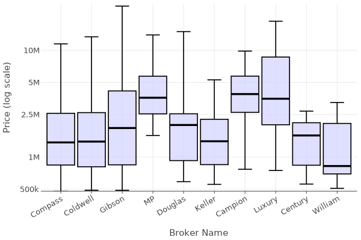
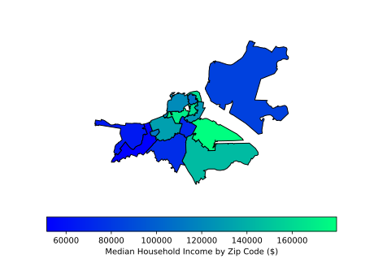
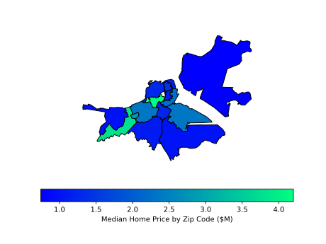
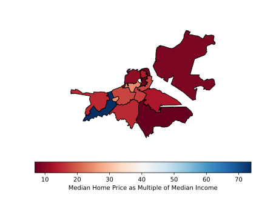
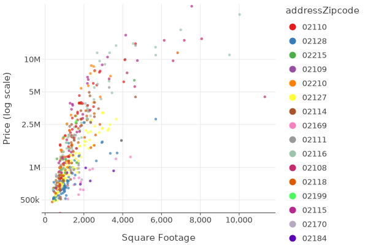

# ME204 (2024) | Thomas' Project

## About Me 
Hello, my name is Thomas Hong, and I am a CS + Econ undergrad at Rice University. I created this project as my final for LSE's summer course ME204. 

## Introduction

I decided to investigate home pricing information in my home city (Boston). That was my initial approach to the assignment, then I realized that I could make even more insight if I were able to get data zip code by zip code. So, I scraped the USA census website for this information.

## Zillow

Zillow was giving me a hard time. I tried doing a basic Selector scrape, but I think Zillow rendered more dynamically, so only 9 results (of around 40) would show up on any given page based on HTML Selectors. However, after experimenting with Selenium and Spiders, I discovered that a stray script tag contained json information for all 40 or so listings on the page even if they weren't yet loaded in. So, I used a Selector and made a very specific css path, then I did some string manipulation to save just the json in json format. Also, I originally scraped zillow just by the region of "Boston-ma," but Zillow maxed out at 20 pages, so I found another site which contained all of Boston's zip codes, then I scraped Zillow zip code by zip code. 

## Census Website

The USA census webstie loaded super dynamically (good for them). However, not so nice for us web scrapers. So, I (with Alex's help) used a hidden API to fetch key information about each zip code. This was in JSON format, but very nested, so I saved a list of JSONs which I would narrow down later. 

## Data Processing

The processing was not too complicated. I set up types correctly for the Zillow data. For census data, I had to dig into a nested dictionary to find the value and label for each key metric. 

## Data Exploration

Again, not too complicated. At this step, I realized I would need another data source to give me shape objects for each zip code. So, I went to this site [https://gis.data.mass.gov/maps/81d760af6cd54809966bc799ca28926d/about] which contained a GeoJson for download. I added the GeoJson to my project before loading it in as a GeoPandas DF. From there, I aggregated housing information by zip code, and I performed two merges to get each zip code as a row with all collected metrics as columns. I mainly focused on price for this step, but so many other metrics could be focused on for further exploration. I made several plots including median price per zip code, median income per zip code, the ratio of med_price/med_income per zip code. I plotted these three geographically. I also made two more plots, a boxplot of price per zip code and a boxplot of price per realtor. 

## Results
Price by Zip Code

Price by Realtor

Map of Median Income

Map of Median Home Price

Map of Price per Income Multiplier

Price and Square Feet with Zip Codes

## Takeaways
Boston famously has extreme income inequality. This has been exaserbated by generational accumulation of wealth, especially with white Bostonians. Most of the graphs show this disparity vividly. The traditionally wealthier areas (South End, Back Bay) have considereably higher income and much higher home prices. However, in Back Bay, we see a tremendous multiple of home prices compared to income. My theory for this is that many people rent in this area, so their income may be lower than home-owners, but that is not reflected in the Zillow data. 

## Future Exploration
There is always the opportunity to do a similar analysis with more (and bigger) cities. Boston has a very small footprint with not many zip codes, so a bigger city like LA or Chicago could have even more granular data. Also, there are many more metrics to explore zip code by zip code, as we see in the census data. Also, should you take this to a new city, I would recommend loading the census data first, seeing which zip codes have some population, and then scraping Zillow data from there. 
